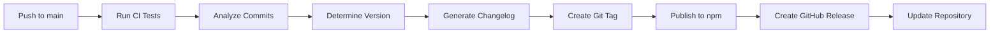

# Publishing Guide

This document explains how the automated publishing system works for markmv.

## 🚀 Automated Publishing Workflow

### Publishing Triggers

1. **Automatic Release (Recommended)**
   - Triggered on every push to `main` branch
   - Uses conventional commits to determine version bump
   - Runs full test suite before publishing
   - Creates GitHub releases and publishes to npm

2. **Manual Publishing**
   - Workflow dispatch trigger available
   - Use for emergency releases or testing
   - Allows specifying custom version tags

### Release Process

#### Automatic Process (via semantic-release)


#### Manual Process
```bash
# Trigger manual publishing workflow
gh workflow run publish.yml -f tag=v1.0.0
```

## 📦 Package Configuration

### Files Included in Package
- `dist/**/*` - Compiled TypeScript output
- `README.md` - Project documentation
- `CHANGELOG.md` - Generated release notes
- `CONTRIBUTING.md` - Contribution guidelines

### Publishing Settings
- **Registry**: npm public registry
- **Access**: Public package
- **Node.js**: Requires >= 18.0.0
- **License**: CC BY-NC-SA 4.0

## 🔧 Required Secrets

To enable automatic publishing, configure these GitHub repository secrets:

### NPM_TOKEN
1. Create npm account and login: `npm login`
2. Generate access token: `npm token create --access public`
3. Add token to GitHub repository secrets as `NPM_TOKEN`

### GITHUB_TOKEN
- Automatically provided by GitHub Actions
- Used for creating releases and updating repository

## 📋 Pre-Publishing Checks

Before each publish, the system automatically:

1. **Code Quality**
   - Runs ESLint and Biome checks
   - Verifies TypeScript compilation
   - Ensures all tests pass

2. **Build Verification**
   - Compiles TypeScript to JavaScript
   - Verifies CLI executable works
   - Checks package contents

3. **Version Management**
   - Analyzes commit messages
   - Determines appropriate version bump
   - Updates package.json and CHANGELOG.md

## 🎯 Version Bumping Rules

Based on conventional commits:

| Commit Type | Version Bump | Example |
|-------------|--------------|---------|
| `feat:` | Minor (0.1.0 → 0.2.0) | `feat: add new splitting strategy` |
| `fix:` | Patch (0.1.0 → 0.1.1) | `fix: resolve link parsing issue` |
| `BREAKING CHANGE:` | Major (0.1.0 → 1.0.0) | `feat!: redesign CLI interface` |
| Other types | Patch | `docs: update README` |

## 🚦 Release Status

### Current Status
- ✅ CI/CD pipeline configured
- ✅ Semantic release setup
- ✅ npm publishing enabled
- ✅ GitHub releases automated
- ✅ Changelog generation

### Monitoring Releases
- **GitHub**: Check [Releases page](https://github.com/joe-mearman/markmv/releases)
- **npm**: Check [npm package page](https://www.npmjs.com/package/markmv)
- **CI/CD**: Monitor [Actions tab](https://github.com/joe-mearman/markmv/actions)

## 🛠️ Troubleshooting

### Common Issues

**Publishing fails with authentication error:**
- Verify `NPM_TOKEN` secret is correctly set
- Ensure token has public publishing permissions
- Check token hasn't expired

**Version not bumping:**
- Verify commit messages follow conventional format
- Check if commits contain changes that warrant version bump
- Review semantic-release logs for analysis details

**Build fails during publishing:**
- Ensure all tests pass locally
- Check TypeScript compilation errors
- Verify all dependencies are properly declared

### Manual Recovery

If automatic publishing fails:

```bash
# 1. Fix the issue locally
npm run build
npm run test:run

# 2. Create proper conventional commit
npm run commit

# 3. Push to trigger automatic release
git push origin main

# 4. Or trigger manual workflow if needed
gh workflow run publish.yml
```

## 📚 Additional Resources

- [Semantic Release Documentation](https://semantic-release.gitbook.io/)
- [Conventional Commits Specification](https://www.conventionalcommits.org/)
- [npm Publishing Guide](https://docs.npmjs.com/cli/v8/commands/npm-publish)
- [GitHub Actions Documentation](https://docs.github.com/en/actions)

---

**Note**: Publishing is fully automated based on conventional commits. Focus on writing clear, conventional commit messages and the system handles the rest!